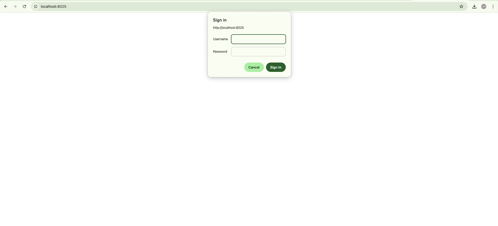
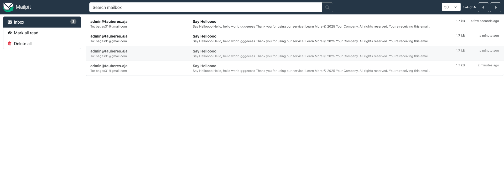
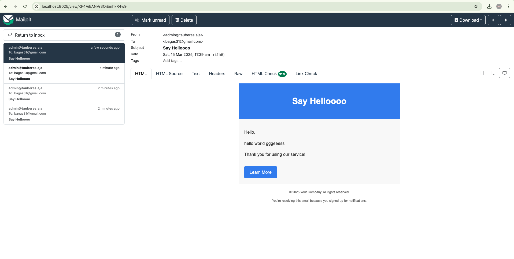

# Mailpit

Email & SMTP testing tool with API for developers


## Docker Installation

For basic usage

```bash
  docker run -d \
    --restart unless-stopped \
    --name=mailpit \
    -p 8025:8025 \
    -p 1025:1025 \
    axllent/mailpit
```

With auth implementation
```bash
  docker run -d \
    --name=mailpit \
    --restart unless-stopped \
    -e MP_UI_AUTH="admin:B1smill@h" \
    -e TZ=Asia/Jakarta \
    -p 8025:8025 \
    -p 1025:1025 \
    axllent/mailpit
```
## Tech Stack

**Golang:** v1.24.1

**Frameworks:** GoFiber


## Screenshots





